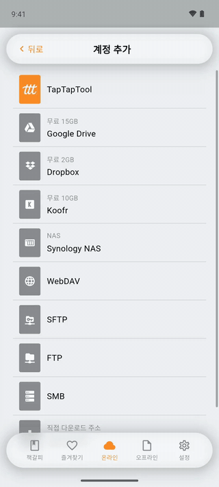
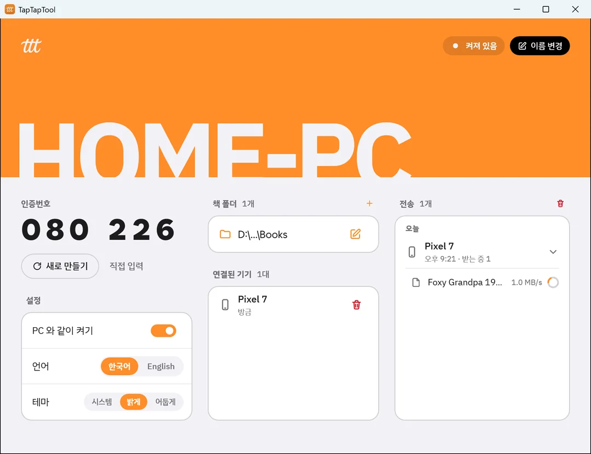
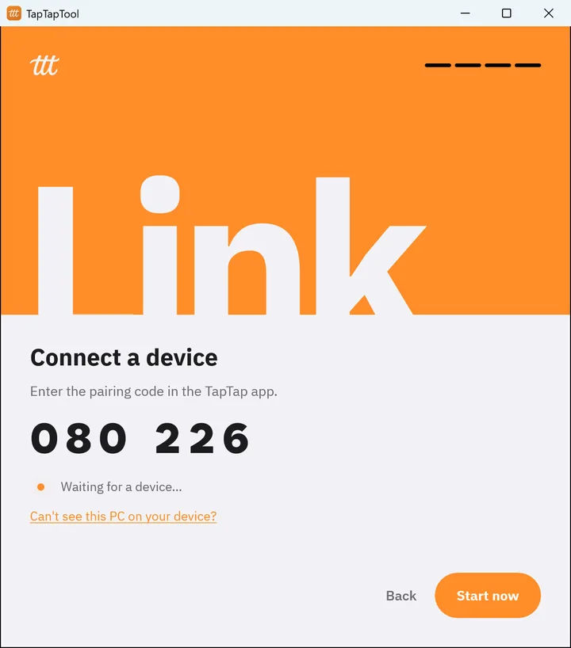
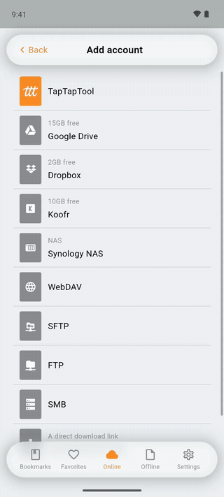
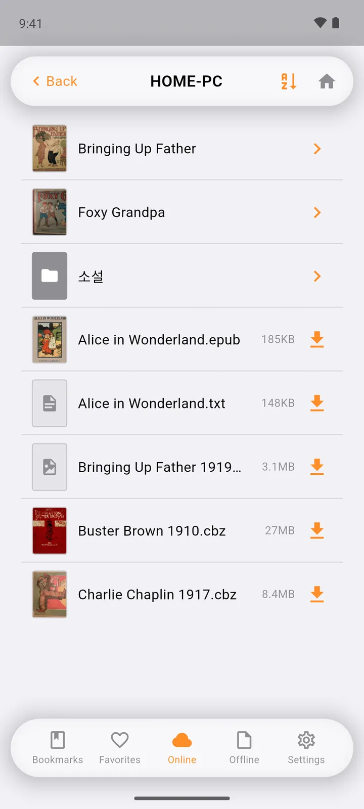
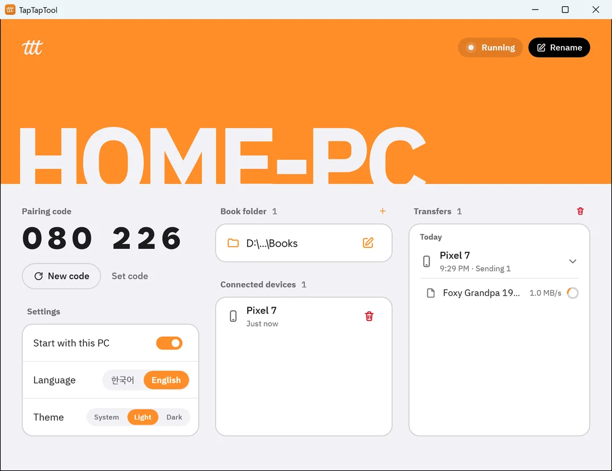

# TapTapTool

[English](#taptaptool-1)

PC 에 둔 만화책·소설을 같은 와이파이의 폰·태블릿에서 받는 프로그램입니다.
만화·소설 뷰어 [TapTap](https://nion.kr/apps/taptap) 의 '내 PC'와 함께 씁니다.

- 케이블도 클라우드도 필요 없습니다. 같은 와이파이면 됩니다.
- 광고·계정·서버가 없습니다. 인터넷으로 나가는 통신이 없고, 책은 PC 에서 기기로만 갑니다.
- 연결은 암호화되고, 인증번호로 페어링 된 기기만 받을 수 있습니다.

---

## 필요한 것

| | |
|---|---|
| PC | Windows 10 · 11 (64비트) · macOS 13 이상(Apple 실리콘 · Intel) |
| 기기 | TapTap **0.7.0 이상** - [Google Play](https://play.google.com/store/apps/details?id=kr.nion.taptap) · App Store |
| 네트워크 | PC 와 기기가 **같은 와이파이**(같은 공유기) |

## 설치 - Windows

1. [Releases](../../releases) 에서 `TapTapTool-windows-x64-<버전>.zip` 을 받습니다.
2. 아무 곳에나 압축을 풉니다(예: `문서\TapTapTool`). 설치 과정은 없습니다.
3. 폴더 안의 `TapTapTool.exe` 를 실행합니다.

**'Windows 의 PC 보호' 창이 뜨면** - '추가 정보' → '실행'을 누르세요.
아직 코드 서명을 하지 않은 프로그램이라 뜨는 창입니다.

**방화벽 창이 뜨면** - **'개인'과 '공용'을 모두 체크**하고 '액세스 허용'을 누르세요.
집 와이파이가 '공용'으로 잡혀 있는 PC 가 많아서, '개인'만 허용하면 기기에서 PC 가 안 보일 수 있습니다.

## 설치 - Mac

1. [Releases](../../releases) 에서 `TapTapTool-macos-<버전>.dmg` 를 받아 엽니다.
2. TapTapTool 을 **'응용 프로그램' 폴더로 끌어다 놓습니다.**
3. 응용 프로그램에서 TapTapTool 을 실행합니다. Apple 의 공증을 받은 프로그램이라 경고 없이 열립니다.

**'들어오는 네트워크 연결을 허용하겠습니까?'가 뜨면** - '허용'을 누르세요. 맥 방화벽을 켜 둔 경우에만 뜹니다.

## 첫 실행

네 단계를 지나면 끝납니다.

1. **언어** - 한국어 / English. 나중에 설정에서도 바꿀 수 있습니다.
2. **책 폴더** - 기기에서 둘러볼 폴더를 지정합니다. 폴더는 나중에 더 추가할 수 있습니다.
3. **PC 와 같이 켜기**(Mac 은 **맥과 같이 켜기**) - 켜 두면 PC 만 켜도 바로 받을 수 있습니다. 트레이(Mac 은 메뉴 막대)에서 조용히 실행됩니다.
4. **기기 연결** - 여섯 자리 인증번호가 보입니다. 이 화면을 띄운 채로 기기에서 연결합니다(아래).
   연결은 나중에 해도 됩니다 - '바로 시작하기'.

## 기기에서 연결하기

1. TapTap 앱 › **온라인** 탭 › 오른쪽 위 **+** › **TapTapTool**
2. 앱이 같은 와이파이의 PC 를 찾습니다(수 초 내). 찾은 PC 를 누릅니다.
3. PC 화면의 **인증번호 여섯 자리**를 넣습니다.

이제 온라인 탭에 PC 가 생깁니다. 누르면 책 폴더를 둘러보고, 파일이나 폴더째 받을 수 있습니다.
표지도 PC 에서 바로 보입니다. 받은 책은 기기의 서재 폴더에 들어갑니다.

 &nbsp; 

- 기기는 몇 대든 연결할 수 있습니다. 모든 기기가 같은 인증번호를 씁니다.
- 앱 하나에 PC 를 여러 대 연결할 수도 있습니다.
- 아이폰은 처음 찾을 때 '로컬 네트워크' 허용을 묻습니다 - **허용**을 눌러야 PC 를 찾습니다.

## 대시보드

| 칸 | 할 수 있는 것 |
|---|---|
| 헤더 | PC 이름 · **이름 변경**(비우면 컴퓨터 이름을 씁니다) |
| 인증번호 | **새로 만들기** · **직접 입력** - 바꿔도 이미 연결된 기기는 끊기지 않습니다 |
| 책 폴더 | **추가** · **변경** · **빼기**. 둘 이상이면 기기 첫 화면에 폴더가 줄로 섭니다 |
| 연결된 기기 | 마지막 연결 시각 · **해제** - 다시 연결하려면 인증번호가 필요합니다 |
| 설정 | PC(맥)와 같이 켜기 · 언어 · 테마 |
| 전송 | 기기가 받은 것이 날짜·기기별로 보입니다(30일). **이력 지우기**로 지웁니다 |

**창을 닫아도 꺼지지 않습니다** - 트레이(Mac 은 메뉴 막대)로 들어가 계속 돕니다.
- Windows: 트레이 아이콘을 누르면 창이 다시 열리고, 오른쪽 클릭 › **끝내기**로 완전히 끕니다.
- Mac: 메뉴 막대 아이콘 › **열기** · **끝내기**. 창이 떠 있을 때는 ⌘Q 로도 끕니다.

## 기기에서 PC 가 안 보일 때

| 확인할 것 | |
|---|---|
| TapTapTool 이 켜져 있나요? | 트레이(Mac 은 메뉴 막대)에 아이콘이 있는지 봅니다 |
| 같은 와이파이인가요? | 폰이 모바일 데이터나 다른 공유기에 붙어 있지 않은지 봅니다 |
| 게스트·공용 와이파이인가요? | 카페·회사·게스트 망은 기기끼리 막혀 있는 경우가 많습니다 |
| 방화벽에서 막혔나요? | Windows: 'Windows 보안 › 방화벽 › 앱 허용'에서 TapTapTool 의 **개인·공용**을 모두 체크합니다 Mac: 시스템 설정 › 네트워크 › 방화벽 › 옵션에서 TapTapTool 을 **허용**으로 둡니다 |
| 아이폰인가요? | 설정 › TapTap › **로컬 네트워크**를 켭니다 |
| 그래도 안 되면 | 앱의 **주소 직접 입력**에 PC 주소를 넣습니다. 주소는 PC 의 연결 화면 도움말에 보입니다 |

| 앱에 이런 말이 뜨면 | |
|---|---|
| '{PC} 에 닿지 않아요' | PC 가 꺼졌거나 잠들었습니다. 노트북이면 덮개를 엽니다 |
| '번호가 맞지 않아요' | PC 화면의 번호를 다시 봅니다. 너무 많이 틀리면 잠시 기다려야 합니다 |
| 'PC 가 바뀐 것 같아요' | PC 에서 TapTapTool 을 새로 설치했을 때 뜹니다. 앱에서 그 계정을 지우고 다시 추가합니다 |
| 'TapTapTool 이 오래된 버전입니다' | PC 의 TapTapTool 을 새 버전으로 바꿉니다(아래 '업데이트') |

**'다른 프로그램이 포트 47800 을 쓰고 있어요'가 뜨면** - TapTapTool 이 이미 켜져 있는지(트레이 · 메뉴 막대) 보고, 그 프로그램을 끈 뒤 다시 켭니다.
**'TapTapTool 을 시작하지 못했어요'가 뜨면** - PC(맥)를 다시 시작한 뒤 켜 봅니다.

**받는 동안은 PC 가 스스로 잠들지 않습니다.** 덮개를 닫거나 직접 절전으로 보내면 받기가 멈춥니다 - 다시 켜고 받으면 받은 데부터 이어 받습니다.

## 업데이트

- Windows: 트레이 › **끝내기** → 새 zip 을 같은 폴더에 덮어 풉니다 → `TapTapTool.exe` 실행
- Mac: 메뉴 막대 › **끝내기** → 새 dmg 의 TapTapTool 을 '응용 프로그램'에 끌어다 놓고 '대치' → 실행

설정·연결된 기기·책 폴더는 그대로 남습니다(아래 '저장 위치'에 따로 있습니다).
자동 업데이트는 없습니다 - 새 버전은 이 저장소의 [Releases](../../releases) 에 올라옵니다.

## 지우기

1. 대시보드 › 설정 › **PC 와 같이 켜기**(Mac 은 **맥과 같이 켜기**)를 끕니다
2. 트레이(메뉴 막대) › **끝내기**
3. Windows 는 압축을 푼 폴더를, Mac 은 '응용 프로그램'의 TapTapTool 을 지웁니다
4. 설정까지 지우려면 아래 '저장 위치'의 폴더도 지웁니다

설정 폴더를 지우고 다시 설치하면 기기에서는 'PC 가 바뀐 것 같아요'가 뜹니다 - 앱에서 계정을 지우고 다시 추가하세요.

## 개인정보 · 보안

- 인터넷으로 나가는 통신이 없습니다. 업데이트 확인·통계·광고·계정 모두 없습니다.
- 같은 와이파이의 기기가 묻는 것에만 답합니다(TCP 47800). 책 폴더를 **읽기만** 하고, 고치거나 지우지 않습니다.
- 연결은 TLS 로 암호화됩니다. 기기는 처음 페어링할 때 이 PC 의 인증서를 기억하고, 그 뒤로는 같은 PC 에만 붙습니다.
- 인증번호로 페어링 된 기기만 받을 수 있습니다. 번호를 여러 번 틀리면 잠깁니다.
- 저장 위치 - 설정 · 연결된 기기 목록 · 받기 이력(30일)
  - Windows: `%APPDATA%\kr.nion\taptap_tool` - 인증서 열쇠는 윈도우가 암호화해 둡니다
  - Mac: `~/Library/Containers/kr.nion.taptaptool` - 앱 전용 보관함(샌드박스) 안에 있어 다른 앱이 못 읽습니다

## 문의

taptap@nion.kr · [nion.kr/apps/taptap](https://nion.kr/apps/taptap)

---

# TapTapTool

[한국어](#taptaptool)

TapTapTool lets your phone or tablet download comics and books from your PC over the same Wi-Fi.
It works with **My PC** in [TapTap](https://nion.kr/apps/taptap), a comic and e-book reader.

- No cable, no cloud - just the same Wi-Fi.
- No ads, no account, no server. Nothing goes out to the internet; books go from your PC to your device only.
- The connection is encrypted, and only devices paired with the code can download.

### Requirements

| | |
|---|---|
| PC | Windows 10 · 11 (64-bit) · macOS 13 or later (Apple silicon · Intel) |
| Device | TapTap **0.7.0 or later** - [Google Play](https://play.google.com/store/apps/details?id=kr.nion.taptap) · App Store |
| Network | PC and device on the **same Wi-Fi** (same router) |

### Install - Windows

1. Download `TapTapTool-windows-x64-<version>.zip` from [Releases](../../releases).
2. Unzip it anywhere (e.g. `Documents\TapTapTool`). There is no installer.
3. Run `TapTapTool.exe` in the folder.

**If "Windows protected your PC" appears** - click "More info" → "Run anyway". The program isn't code-signed yet.

**If a firewall window appears** - check **both "Private" and "Public"**, then click "Allow access".
Many home Wi-Fi networks are set as "Public", so allowing only "Private" can hide the PC from your device.

### Install - Mac

1. Download `TapTapTool-macos-<version>.dmg` from [Releases](../../releases) and open it.
2. **Drag TapTapTool into Applications.**
3. Run TapTapTool from Applications. It's notarized by Apple, so it opens without warnings.

**If "Do you want to allow incoming network connections?" appears** - click "Allow". It only appears when the Mac firewall is on.

### First run

1. **Language** - 한국어 / English. You can change it later in Settings.
2. **Book folder** - set the folder to browse from your device. You can add more later.
3. **Start with this PC** (**Start with this Mac** on Mac) - when on, you can download as soon as the computer is on. It runs quietly in the tray (the menu bar on Mac).
4. **Connect a device** - a six-digit code appears. Keep this screen open and connect from your device (below).
   You can also connect later - "Start now".

### Connect from your device

1. TapTap › **Online** tab › **+** at the top right › **TapTapTool**
2. The app looks for PCs on the same Wi-Fi (within seconds). Tap your PC.
3. Enter the **six-digit code** shown on the PC.

Your PC now appears in the Online tab. Tap it to browse your book folders and download files or whole folders.
Covers show right from the PC. Downloaded books go into your library folder on the device.

 &nbsp; 

- Connect as many devices as you like. They all use the same code.
- One app can connect to several PCs.
- On iPhone, allow **Local Network** when asked - otherwise the app can't find the PC.

### Dashboard

| Section | What you can do |
|---|---|
| Header | PC name · **Rename** (leave it empty to use the computer name) |
| Pairing code | **New code** · **Set code** - devices already connected stay connected |
| Book folders | **Add** · **Change** · **Remove**. With two or more, they appear as rows on the device's first screen |
| Connected devices | Last connected · **Remove** - reconnecting needs the code |
| Settings | Start with this PC (Mac) · Language · Theme |
| Transfers | What devices downloaded, by date and device (30 days). **Clear history** to remove |

**Closing the window doesn't quit** - it keeps running in the tray (the menu bar on Mac).
- Windows: click the tray icon to reopen; right-click › **Quit** to stop it completely.
- Mac: menu bar icon › **Open** · **Quit**. While the window is open, ⌘Q also quits.

### When your device can't find the PC

| Check | |
|---|---|
| Is TapTapTool running? | Look for its icon in the tray (the menu bar on Mac) |
| Same Wi-Fi? | Make sure the phone isn't on mobile data or another router |
| Guest or public Wi-Fi? | Café, office and guest networks often block devices from seeing each other |
| Blocked by the firewall? | Windows: in "Windows Security › Firewall › Allow an app", check **Private and Public** for TapTapTool Mac: System Settings › Network › Firewall › Options, set TapTapTool to **Allow** |
| iPhone? | Settings › TapTap › turn on **Local Network** |
| Still nothing | Use **Enter address** in the app. The PC's address is shown in the help on its Connect screen |

| If the app says | |
|---|---|
| "Can't reach {PC}" | The PC is off or asleep. If it's a laptop, open the lid |
| "Wrong code" | Check the code on the PC. After too many tries, wait a moment |
| "The PC seems to have changed" | TapTapTool was reinstalled on the PC. Remove the account in the app and add it again |
| "TapTapTool is out of date" | Update TapTapTool on the PC (see "Update") |

**If "Another program is using port 47800" appears** - check whether TapTapTool is already running (tray · menu bar), close that program, then start again.
**If "TapTapTool couldn't start" appears** - restart the computer and try again.

**The PC won't fall asleep on its own while sending.** Closing the lid or putting it to sleep yourself stops the download - start it again and it resumes where it left off.

### Update

- Windows: Tray › **Quit** → unzip the new version over the same folder → run `TapTapTool.exe`
- Mac: Menu bar › **Quit** → drag TapTapTool from the new dmg into Applications and choose "Replace" → run it

Settings, connected devices and book folders stay (they're stored separately - see "Storage").
There's no auto-update - new versions are posted to [Releases](../../releases).

### Uninstall

1. Dashboard › Settings › turn off **Start with this PC** (**Start with this Mac** on Mac)
2. Tray (menu bar) › **Quit**
3. On Windows, delete the unzipped folder; on Mac, delete TapTapTool from Applications
4. To remove settings too, delete the folder under "Storage" below

If you delete the settings folder and reinstall, your device will say "The PC seems to have changed" - remove the account in the app and add it again.

### Privacy and security

- Nothing goes out to the internet - no update checks, analytics, ads or accounts.
- It only answers devices on the same Wi-Fi (TCP 47800). It **only reads** your book folders and never changes or deletes them.
- The connection is TLS-encrypted. Your device remembers this PC's certificate when pairing and connects only to it afterwards.
- Only devices paired with the code can download. Too many wrong codes lock pairing for a while.
- Storage - settings, connected devices, download history (30 days)
  - Windows: `%APPDATA%\kr.nion\taptap_tool` - the certificate key is encrypted by Windows
  - Mac: `~/Library/Containers/kr.nion.taptaptool` - inside the app's own sandbox, so other apps can't read it

### Contact

taptap@nion.kr · [nion.kr/apps/taptap](https://nion.kr/apps/taptap)
